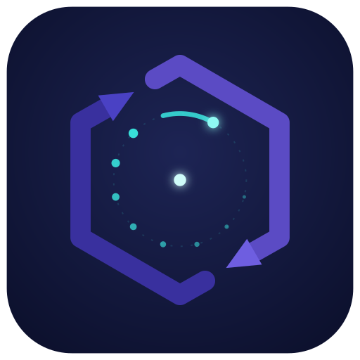

<p align="center">
  
</p>

[](./RELEASE.md)
[](./LICENSE)
[](https://github.com/Antruly/libuvcpp/actions/workflows/ci.yml)

# libuvcpp

🔧 Modern C++11 wrapper for [libuv](https://github.com/libuv/libuv) — event-driven I/O with
object-oriented APIs, dual-mode async/sync support, HTTP/1.1, WebSocket (RFC 6455), and SSL/TLS.

- **Version**: `1.3.2-dev` — **Author**: `zhuweiye` — **License**: `MIT`
- **Languages**: [English](./README.md) · [中文](./README.zh.md)

---

## Overview

libuvcpp provides a thin, idiomatic C++ layer over libuv's event loop, handles, and requests.
It preserves libuv's performance while adding RAII resource management, `std::function` callbacks,
and higher-level client/server abstractions for TCP, UDP, HTTP, and WebSocket.

The library is organized into layered modules:

```
application
┌────────────┐
│ web (HTTP/WS) │  ← uvcpp_http_client/server, uvcpp_ws_client/server
├────────────┤
│ http2        │  ← h2 session/connection layers, nghttp2 glue (`UVCPP_ENABLE_NGHTTP2=ON`)
├────────────┤
│ ssl (TLS)    │  ← uvcpp_ssl, uvcpp_ssl_context (OpenSSL wrapper)
├────────────┤
│ net          │  ← uvcpp_tcp_client/server, uvcpp_udp_client/server
├────────────┤
│ handle + req │  ← uvcpp_loop, uvcpp_tcp, uvcpp_timer, uvcpp_write, ...
├────────────┤
│ uvcpp core   │  ← uvcpp_buf, uvcpp_thread, uvcpp_alloc, ...
└────────────┘
```

---

## Features

### Core (handle + req)

| Category | Classes |
|----------|---------|
| **Event loop** | `uvcpp_loop` |
| **Stream handles** | `uvcpp_tcp`, `uvcpp_pipe`, `uvcpp_udp`, `uvcpp_tty` |
| **Timers & hooks** | `uvcpp_timer`, `uvcpp_idle`, `uvcpp_prepare`, `uvcpp_check` |
| **Signals & process** | `uvcpp_signal`, `uvcpp_process` |
| **File system** | `uvcpp_fs`, `uvcpp_fs_event`, `uvcpp_fs_poll` |
| **Polling** | `uvcpp_poll`, `uvcpp_async` |
| **Requests** | `uvcpp_write`, `uvcpp_connect`, `uvcpp_shutdown`, `uvcpp_work`, `uvcpp_getaddrinfo`, `uvcpp_getnameinfo`, `uvcpp_udp_send`, `uvcpp_random` |

### Utilities (`src/uvcpp/`)

Thread pool, RW locks, barriers, CPU info, network interfaces, passwd/group, directory traversal,
environment variables, buffer management (`uvcpp_buf`), metrics, and allocator integration.

### Expand module (`src/expand/`)

TCMalloc-style memory pool: page heap, span allocator, thread cache, enterprise allocator.
**Off by default** (`UVCPP_BUILD_EXPAND=OFF`) since v1.1.0 — pass
`-DUVCPP_BUILD_EXPAND=ON` to enable it. The prebuilt binaries ship **with** the pool;
consumers define nothing — the package's `uvcpp/uvcpp_config.h` carries the value this
build actually used, and defining a conflicting one yourself is a hard compile error
instead of a silent allocator mismatch (see `RELEASE.md`).

Each prebuilt package also carries a **Debug** build of the library (`uvcppd.dll` /
`libuvcppd.so`, link with `-luvcppd`, plus `uvcppd.pdb` on MSVC) for stepping into the
library. Its prerequisites — chiefly that MSVC's non-redistributable Debug CRT is *not*
in the package — are in [`RELEASE.md`](./RELEASE.md#调试档debug-版).

### Net module (`src/net/`) — `UVCPP_BUILD_NET=ON` (default)

| Class | Description |
|-------|-------------|
| `uvcpp_tcp_client` | High-level TCP client with dual-mode API (async callback / sync `wait()` with timeout) |
| `uvcpp_tcp_server` | TCP server, `bind()` + `listen(connection_cb, backlog)` (the connection callback is `listen()`'s first argument; there is no separate `on_connection()`) |
| `uvcpp_udp_client` | UDP client with dual-mode send/recv |
| `uvcpp_udp_server` | UDP server with `bind()`/`recv_start()` |

### Web module (`src/web/`) — `UVCPP_BUILD_WEB=ON`

| Class | Description |
|-------|-------------|
| `uvcpp_http_client` | HTTP client with keep-alive, streaming parse, dual-mode `send()`/`send_wait()`. HTTP/1.1 by default; opt into HTTP/2 with `set_http2_enabled()` |
| `uvcpp_http_server` | HTTP server with route registration, per-connection parser, upgrade detection. HTTP/1.1 by default; opt into HTTP/2 with `set_http2_enabled()` |
| `uvcpp_http_parser` | Streaming HTTP parser (wraps [llhttp](https://github.com/nodejs/llhttp)), PIMPL pattern |
| `uvcpp_http_request` | Request object with `to_string()` / `from_parser()` serialization |
| `uvcpp_http_response` | Response object with factory methods (`ok()`, `not_found()`, etc.) |
| `uvcpp_ws_client` | WebSocket client (RFC 6455), parses `ws://`/`wss://` URLs, upgrade handshake |
| `uvcpp_ws_server` | WebSocket server, auto-upgrade from HTTP via `on_upgrade()` |
| `uvcpp_ws_connection` | WebSocket connection: `send_text()`/`send_binary()`/`send_ping()`/`send_close()` |
| `uvcpp_ws_parser` | Streaming WebSocket frame parser (RFC 6455), 8-state state machine |
| `uvcpp_ws_frame` | Frame struct with opcode, mask, close-code helpers |
| `uvcpp_http_common` | HTTP method/status enums, version enum (HVER_10/11/20), header helpers |

**Optional features** (opt-in, not auto-enabled):

- `UVCPP_ENABLE_ZLIB=ON` — Per-Message Deflate compression (RFC 7692) for WebSocket
- `UVCPP_ENABLE_OPENSSL=ON` — HTTPS (WSS) via SSL/TLS module
- `UVCPP_ENABLE_NGHTTP2=ON` — HTTP/2 (RFC 9113) via [nghttp2](https://github.com/nghttp2/nghttp2).
  Requires `UVCPP_ENABLE_OPENSSL=ON` (force-disabled without it) — h2 is **TLS + ALPN
  only**: no h2c, no prior knowledge, no RFC 8441, no `:protocol`. It is **off by
  default and nothing upgrades automatically**: `uvcpp_http_server` needs
  `set_http2_enabled(true)` **and** an explicit `set_alpn_select_protos({"h2","http/1.1"})`
  on the SSL context, `uvcpp_http_client` needs `set_http2_enabled(true)` (it builds the
  per-connection ALPN list itself), and `uvcpp_web_app` wires all of it for you. See
  [§13 of the webapp guide](doc/webapp-guide.md#13-http2).

### Web app framework (`src/webapp/`) — `UVCPP_BUILD_WEBAPP=ON`

A higher-level application layer built on the web module: **you write handlers, not
wire formats.** Requires `UVCPP_BUILD_WEB=ON` (webapp is force-disabled when web is off,
rather than leaving a configuration that does not compile). Pulls in
[nlohmann/json](https://github.com/nlohmann/json) via FetchContent for its JSON backend.

| Class | Description |
|-------|-------------|
| `uvcpp_web_app` | The application: config, routing, middleware, lifecycle (`start`/`stop`/`join`) |
| `uvcpp_web_router` | Pattern router — `/user/:id` params, `/files/*path` wildcards, static > param > wildcard |
| `uvcpp_web_request` / `uvcpp_web_response` | Request/response wrappers: query, form, cookies, path params, HTTP status helpers, chunked, `send_file` |
| `uvcpp_web_context` | Per-request context: middleware chain, `post()`, `hold()`/`release()`, user data |
| `uvcpp_web_static` | Static file service: ETag, Last-Modified, Range/206/416, LRU cache, SPA fallback, dotfile policy |
| `uvcpp_web_upload` / `uvcpp_web_multipart` | Streaming multipart upload to disk with random leaf names and six size limits |
| `uvcpp_web_stream` | Streaming request bodies (`on_data`/`on_end`/`pause`/`resume`) |
| `uvcpp_web_ws` | WebSocket endpoints on the app (`app.websocket("/chat/:room", handler)`) |
| `uvcpp_web_ws_client` | WebSocket client with callbacks on the client itself and optional **auto-reconnect** |
| `uvcpp_web_work_limit` | Work-pool admission gate (backpressure for `uv_queue_work`) |
| `uvcpp_log` / `uvcpp_log_console` | Two-axis logging: level + category, pluggable sink |
| `uvcpp_web_json` | JSON helpers around nlohmann/json — no exceptions across libuv callbacks, depth pre-scan |

```cpp
#include <webapp/uvcpp_web_app.h>
using namespace uvcpp;

int main() {
  uvcpp_web_app app;
  app.set_port(8080)
     .use(web_middleware_access_log())
     .use(web_middleware_cors());

  app.get("/hello", [](uvcpp_web_request& req, uvcpp_web_response& resp,
                       uvcpp_web_next next) {
    resp.json_str("{\"hello\":\"world\"}");
    resp.end();
  });

  app.serve_static("/assets", "./public");
  app.websocket("/echo", [](uvcpp_web_ws_request& ws) {
    uvcpp_ws_connection* c = ws.connection();
    c->on_text([c](const std::string& m) { c->send_text(m.c_str(), m.size()); });
  });

  app.start();   // binds, then runs the loop on a background thread
  app.join();
  return 0;
}
```

**→ Full guide: [doc/webapp-guide.md](doc/webapp-guide.md)** — routing rules, middleware,
static/upload/streaming, WebSocket client & reconnect, security, and known limitations.
Runnable example: `examples/webapp_demo.cpp`.

### SSL module (`src/ssl/`) — `UVCPP_ENABLE_OPENSSL=ON`

| Class | Description |
|-------|-------------|
| `uvcpp_ssl_context` | SSL/TLS context (wraps `SSL_CTX*`), cert/key loading, self-signed cert generation |
| `uvcpp_ssl` | Per-connection SSL wrapper, `handshake()`/`read()`/`write()`/`shutdown()` |
| `uvcpp_ssl_common` | `tls_version`, `tls_mode`, `tls_verify_mode`, `tls_cert_info` enums/structs |

### Module guides

The tables above list **what exists**; the pages below explain **how to use it** —
typical flows, error handling, and the places where the header comments disagree with
the implementation. All of them live in `doc/`, and **every code example in them is
compiled by CI** (`tests/tools/check_doc_snippets.py`), so they are safe to copy.

| Module | Guide | What it covers |
|---|---|---|
| Low level (handle + req) | [doc/lowlevel-guide.md](doc/lowlevel-guide.md) | The event loop, handle/request lifetimes, and what `<uvcpp.h>` actually aggregates |
| net | [doc/net-guide.md](doc/net-guide.md) | TCP/UDP clients and servers; the async and sync modes, and where they must not be mixed |
| web (HTTP half) | [doc/web-http-guide.md](doc/web-http-guide.md) | HTTP server/client/parser/static server; why shutdown takes two calls |
| web (WS half) | [doc/web-ws-guide.md](doc/web-ws-guide.md) | WebSocket handshake, frames, close codes |
| webapp (framework) | [doc/webapp-guide.md](doc/webapp-guide.md) | Routing, middleware, request/response, upload, static, WebSocket, logging |
| webapp (support types) | [doc/webapp-support-guide.md](doc/webapp-support-guide.md) | The seven types under the framework: connection identity, web utilities, MIME, multipart, file transfer, per-request context, console logging |
| ssl | [doc/ssl-guide.md](doc/ssl-guide.md) | TLS context and per-connection wrapper — the shortest header set and the easiest to get wrong |
| http2 | [doc/http2-guide.md](doc/http2-guide.md) | Using the low-level session/connection layer; for progress and trade-offs see [doc/http2-status.md](doc/http2-status.md) |
| expand | [doc/expand-guide.md](doc/expand-guide.md) | Memory pool, page heap and span, and why they ship disabled |

Outside the modules there is also [doc/benchmark.md](doc/benchmark.md) for measured
performance, [doc/build-guide.md](doc/build-guide.md) for every CMake switch and build
tree, [doc/testing-guide.md](doc/testing-guide.md) for the test layers,
[doc/ci-guide.md](doc/ci-guide.md) for CI maintenance, and
[doc/release-process.md](doc/release-process.md) for how a release is cut and what that
pipeline does not check.

---

## Requirements

- **C++11** or later
- **CMake** ≥ 3.20
- **Compiler**: MSVC 2019+, GCC 7+, Clang 5+
- **libuv**: auto-fetched via FetchContent if not found on system
- **Platforms**: Windows, Linux, macOS

---

## Build

### Basic build (core only)

```bash
mkdir build && cd build
cmake .. -DCMAKE_BUILD_TYPE=Release -DUVCPP_BUILD_TESTS=ON
cmake --build . --config Release --parallel
ctest --output-on-failure -C Release
```

### With Web module (HTTP + WebSocket)

```bash
cmake .. -DCMAKE_BUILD_TYPE=Release -DUVCPP_BUILD_TESTS=ON \
  -DUVCPP_BUILD_WEB=ON
cmake --build . --config Release --parallel
```

### With Web + SSL + compression (full)

```bash
# Linux: install system deps first
sudo apt-get install libssl-dev zlib1g-dev

cmake .. -DCMAKE_BUILD_TYPE=Release -DUVCPP_BUILD_TESTS=ON \
  -DUVCPP_BUILD_WEB=ON \
  -DUVCPP_ENABLE_OPENSSL=ON \
  -DUVCPP_ENABLE_ZLIB=ON
cmake --build . --config Release --parallel
```

### With the web app framework

```bash
cmake .. -DCMAKE_BUILD_TYPE=Release -DUVCPP_BUILD_TESTS=ON \
  -DUVCPP_BUILD_WEB=ON \
  -DUVCPP_BUILD_WEBAPP=ON \
  -DUVCPP_BUILD_EXAMPLES=ON
cmake --build . --config Release --parallel
# runnable example (self-checking):
./examples/Release/webapp_demo
```

### CMake Options

| Option | Default | Description |
|--------|---------|-------------|
| `UVCPP_BUILD_TESTS` | `ON` | Build test executables |
| `UVCPP_BUILD_FUNCTIONAL` | `ON` | Build the functional test suite (only read when `UVCPP_BUILD_TESTS=ON`) |
| `BUILD_SHARED_LIBS` | `ON` | Build shared libraries |
| `UVCPP_BUILD_STATIC` | auto | Build static uvcpp library |
| `UVCPP_BUILD_SHARED` | auto | Build shared uvcpp library |
| `UVCPP_FOLLOW_LIBUV_BUILD` | `ON` | Keep `UVCPP_BUILD_SHARED`/`UVCPP_BUILD_STATIC` at `auto`, following libuv's own `BUILD_SHARED_LIBS` |
| `UVCPP_BUILD_EXPAND` | `OFF` | Build expand module (memory pool) |
| `UVCPP_BUILD_NET` | `ON` | Build net module (TCP/UDP client/server) |
| `UVCPP_BUILD_WEB` | `OFF` | Build web module (HTTP + WebSocket) |
| `UVCPP_BUILD_WEBAPP` | `OFF` | Build web app framework (router/middleware/static/upload/log). Requires `UVCPP_BUILD_WEB=ON` |
| `UVCPP_BUILD_EXAMPLES` | `OFF` | Build the examples in `examples/` |
| `UVCPP_BUILD_BENCH` | `OFF` | Build the benchmark range in `bench/` — see [`doc/benchmark-rig.md`](doc/benchmark-rig.md) |
| `UVCPP_ENABLE_ZLIB` | `OFF` | Enable zlib (WebSocket compression) |
| `UVCPP_ENABLE_OPENSSL` | `OFF` | Enable OpenSSL (HTTPS/WSS) |
| `UVCPP_ENABLE_NGHTTP2` | `OFF` | Enable HTTP/2 (nghttp2, linked static). Requires `UVCPP_ENABLE_OPENSSL=ON` and `UVCPP_BUILD_WEB=ON` |
| `UVCPP_USE_SYSTEM_LIBUV` | `ON` | Prefer system-installed libuv |
| `UVCPP_BUILD_LIBUV_FROM_SOURCE` | `OFF` | Fetch and build libuv from source via `FetchContent` |
| `UVCPP_STATIC_RUNTIME` | `OFF` | Statically link the compiler runtime (`libgcc`/`libstdc++`) into the library. **MinGW and Linux only — a no-op on MSVC**, which uses `/MD` and ships `vcruntime`/`msvcp` in the package |
| `UVCPP_ENABLE_TRY_WRITE` | `ON` | Try `uv_try_write` before copying into a write buffer |
| `UVCPP_TRY_WRITE_MIN_BYTES` | `32768` | Smallest payload worth attempting `uv_try_write` for (a `CACHE STRING`, not an `option()`) |

**Important**: `UVCPP_ENABLE_ZLIB` and `UVCPP_ENABLE_OPENSSL` are NOT auto-enabled
when `UVCPP_BUILD_WEB=ON`. You must opt in explicitly. `UVCPP_ENABLE_NGHTTP2` is
**force-disabled** when `UVCPP_ENABLE_OPENSSL=OFF` (it warns rather than leaving a
configuration that cannot work) — HTTP/2 here has no cleartext mode.

---

## Quick Start

### TCP Echo Server

```cpp
#include "uvcpp.h"
#include "net/uvcpp_tcp_server.h"
#include <iostream>

int main() {
    uvcpp::uvcpp_tcp_server server;
    server.bind("127.0.0.1", 8080);

    // One shared read callback for every connection: data, peer-close and
    // read-error arrive as three distinct events, so you never have to work
    // out why the data stopped coming.
    server.set_read_callback([](uvcpp::uvcpp_tcp_client& client,
                                const uvcpp::net_read_result& r) {
        if (r.is_data()) {
            std::cout << "Received: " << std::string(r.data, r.size) << std::endl;
            // Passing the callback is what makes this an async write; with no
            // callback it degrades to write_wait() and waits on the loop thread.
            client.write(r.data, r.size, [](int) {});
        } else {
            std::cout << "Client disconnected" << std::endl;
        }
    });

    // The connection callback is listen()'s first argument, not a separate
    // on_connection(). Set the read callback before listen().
    server.listen([](uvcpp::uvcpp_tcp_client* client) {
        std::cout << "Client connected" << std::endl;
    });

    std::cout << "Echo server on :8080" << std::endl;
    server.run();
    return 0;
}
```

### HTTP GET Request

```cpp
#include "web/uvcpp_http_client.h"
#include <iostream>

int main() {
    uvcpp::uvcpp_http_client client;

    client.get("http://httpbin.org/get",
               [](const uvcpp::uvcpp_http_response& rsp, int err) {
        if (err) return;
        std::cout << "Status: " << static_cast<int>(rsp.status_code) << std::endl;
        std::cout << "Body: "
                  << std::string(rsp.body.get_const_data(), rsp.body.size())
                  << std::endl;
    });

    client.run();
    return 0;
}
```

### WebSocket Client

```cpp
#include "web/uvcpp_ws_client.h"
#include <iostream>

int main() {
    uvcpp::uvcpp_ws_client client;

    client.connect("ws://echo.websocket.org/chat",
        [](uvcpp::uvcpp_ws_connection* conn, int err) {
            if (err) return;

            conn->on_text([](const std::string& msg) {
                std::cout << "Echo reply: " << msg << std::endl;
            });

            const std::string msg = "Hello WebSocket!";
            conn->send_text(msg.c_str(), msg.size());
        });

    client.run();
    return 0;
}
```

### WebSocket Server

```cpp
#include "web/uvcpp_ws_server.h"
#include <iostream>

int main() {
    uvcpp::uvcpp_ws_server server;
    server.bind("127.0.0.1", 8080);

    server.on_connection([](uvcpp::uvcpp_ws_connection* conn) {
        std::cout << "WS client connected" << std::endl;

        conn->on_text([conn](const std::string& msg) {
            std::cout << "Received: " << msg << std::endl;
            const std::string reply = "Echo: " + msg;
            conn->send_text(reply.c_str(), reply.size());
        });

        // Session end is (close code, reason) — not the connection pointer.
        conn->on_close([](uvcpp::ws_close_code code, const std::string& reason) {
            std::cout << "WS client disconnected: "
                      << static_cast<int>(code) << " " << reason << std::endl;
        });
    });

    server.listen();
    server.run();
    return 0;
}
```

### SSL/TLS Server

```cpp
#include "ssl/uvcpp_ssl_context.h"
#include "net/uvcpp_tcp_server.h"

int main() {
    // Create SSL context
    uvcpp::uvcpp_ssl_context ssl_ctx(uvcpp::tls_mode::SERVER);
    ssl_ctx.generate_self_signed("localhost");  // or load_certificate_file()

    uvcpp::uvcpp_tcp_server server;
    server.set_ssl_context(&ssl_ctx);
    server.bind("127.0.0.1", 8443);
    // ... set_read_callback, listen, run
}
```

---

## Testing

```bash
# Build with tests
cmake -S . -B build -DCMAKE_BUILD_TYPE=Release -DUVCPP_BUILD_TESTS=ON
cmake --build build --config Release --parallel

# Run all tests
ctest --test-dir build --output-on-failure -C Release

# Run only web module tests
ctest --test-dir build -C Release -R "web_"

# Run with exclusions (test_shutdown_func fails ~1% of runs — flaky, not hanging; doc/ci-guide.md §4)
ctest --test-dir build -C Release --exclude-regex "test_shutdown_func"
```

### Optional gate: run the whole suite under PageHeap

On a plain run a freed page is still mapped and still holds the old bytes — **use-after-free is
silent**. Full PageHeap unmaps a freed block immediately, turning the same read into an access
violation on the spot. It once caught 8 use-after-free cases while the normal build, the
no-memory-pool build and the unit-test layer were all green.

```bash
# Needs gflags.exe from the Windows SDK debugging tools (usually an elevated shell)
python -u tests/tools/run_pageheap_gate.py --tree build-webapp
```

It takes a baseline by running the suite plainly first, then goes case by case
"enable PageHeap → re-read the registry → run → disable → re-read", and only counts
"green baseline, crashed under PageHeap" as a catch. Exit codes: `0` all green,
`1` the gate failed, `3` the gate itself could not run (baseline red / PageHeap never took
effect / did not clean up / it was exercising a stale DLL).

**It is markedly slower**, which is why it is not in the default ctest suite. PageHeap is
switched off in each case's `finally`, with `atexit` and `Ctrl-C` as backstops — leftovers make
every later test on the machine an order of magnitude slower.

Test coverage:
- **Unit tests**: `tests/unit/` — handle types, request types, uvcpp utilities
- **Functional tests**: `tests/functional/` — runtime behavior for all modules
- **Expand tests**: `tests/expand/` — memory pool allocation tests

---

## Multi-loop scaling (`set_loops`)

One event loop can only ever occupy one core. Once that core is saturated, `set_loops(n)`
runs **1 acceptor loop + n−1 worker loops** inside a single process: the accept path stays
on one thread, and connection I/O is spread across the workers.

```cpp
#include <webapp/uvcpp_web_app.h>
using namespace uvcpp;

int main() {
  uvcpp_web_app app;
  app.set_host("0.0.0.0").set_port(8080).set_access_log(false);

  // 1 acceptor + 3 worker loops. Not chainable, and must precede start()/run().
  const int rc = app.set_loops(4);
  if (rc != 0) return 1;

  app.get("/json", [](uvcpp_web_request&, uvcpp_web_response& resp,
                      uvcpp_web_next) {
    resp.json_str("{\"hello\":\"world\"}");
    resp.end();
  });

  app.start();   // n > 1 needs start()/start_background(); run(md) is rejected
  app.join();
  return 0;
}
```

Worth knowing before you turn it on:

- **Call it before `start()` / `run()`.** Register your routes before `start()` as well —
  with `n > 1` that stops being advice and becomes a requirement.
- **`set_loops` returns `int`, so it cannot be chained** onto the
  `set_host(...).set_port(...)` builder. It returns `0` on success, `UV_EINVAL` when `n`
  is outside `1..64`, and `UV_EBUSY` if the runtime has already started.
- **`n == 1` is byte-for-byte the behaviour of never calling it** — no slots, no hooks, no
  extra thread. Switching the knob on at 1 costs nothing.
- **With `n > 1`, `run(md)` is rejected with `UV_EINVAL`.** Use `start()` /
  `start_background()`, then `stop()` and `join()`.
- **The acceptor loop carries no connections.** `loop_count()` reports how many loops
  exist and `connection_count_at(i)` how many each holds — index `0` is the acceptor and
  stays at zero while the workers share the load.

**→ Sizing, core pinning, and what makes a scaling reading valid or invalid:
[doc/benchmark-rig.md](doc/benchmark-rig.md).**

---

## Project Structure

```
libuvcpp/
├── src/
│   ├── uvcpp/     # Core utilities (buf, thread, version, alloc, ...)
│   ├── handle/    # libuv handle wrappers (loop, tcp, udp, timer, ...)
│   ├── req/       # libuv request wrappers (write, connect, fs, work, ...)
│   ├── expand/    # Memory pool (page heap, span, enterprise allocator)
│   ├── net/       # TCP/UDP client/server
│   ├── web/       # HTTP client/server, WebSocket client/server, frame parser
│   ├── webapp/    # Web app framework (router, middleware, static, upload, WS client, log)
│   ├── http2/     # HTTP/2 session/connection layers, nghttp2 glue, ALPN (uvcpp_h2_nghttp2.h is private)
│   └── ssl/       # SSL/TLS context and connection wrapper
├── tests/
│   ├── unit/      # Unit tests
│   ├── functional/# Functional/integration tests
│   ├── tools/     # Test tooling (e.g. mutation harnesses)
│   └── expand/    # Memory pool tests
├── examples/      # Runnable examples (webapp_demo)
├── doc/           # Documentation
│   ├── benchmark.md       # Measured per-connection memory, throughput, stability
│   ├── build-guide.md     # Every CMake switch, build trees, platform deps
│   ├── ci-guide.md        # CI maintenance guidelines
│   ├── expand-guide.md    # Memory pool / page heap / span usage
│   ├── http2-guide.md     # Using the low-level HTTP/2 session and connection layers
│   ├── http2-status.md    # HTTP/2 support status
│   ├── lowlevel-guide.md  # Event loop, handles and requests (the foundation)
│   ├── net-guide.md       # TCP/UDP clients and servers
│   ├── release-process.md # How a release is cut, and what it does not check
│   ├── ssl-guide.md       # TLS context and per-connection wrapper
│   ├── testing-guide.md   # Test layers, filename filters, tests/tools index
│   ├── web-http-guide.md  # The HTTP half of the web layer
│   ├── web-ws-guide.md    # The WebSocket half of the web layer
│   ├── webapp-guide.md    # Web app framework guide
│   └── webapp-support-guide.md # Types under webapp not covered by the framework guide
├── cmake/         # CMake config templates
├── .github/workflows/  # CI pipeline
├── CMakeLists.txt
├── CONTRIBUTING.md     # Clone -> build -> test, plus the repo's conventions
├── README.md
├── README.zh.md
└── RELEASE.md          # Release notes / history
```

---

## CI & Contributing

CI runs on every push and PR via GitHub Actions. See [doc/ci-guide.md](doc/ci-guide.md) for
the CI maintenance guidelines — contributors modifying the CI must read it first.

Contributions are welcome. Please open an issue or PR, keep changes focused, and follow
the existing code style.

---

## Changelog

The current source tree is **1.3.2-dev** — that is what `UVCPP_VERSION_STRING`
(`src/uvcpp/uvcpp_version.h`) reports. `v1.0.0`, `v1.1.0`, `v1.2.0` and `v1.3.0` are the
tagged releases. Everything the `1.1.x` and `1.2.x` development lines accumulated between
`v1.1.0` and `v1.3.0` is below, by theme, with the version each change first appeared in;
release notes for the tagged versions are in [RELEASE.md](./RELEASE.md). Several of the
fixes came from issue reports by the project's first external contributor,
[@sercebr](https://github.com/sercebr).

### HTTP/2

For the current state of the implementation — what is enforced, what the defaults are, and
what is deliberately not supported — see [`doc/http2-status.md`](doc/http2-status.md).

- [nghttp2](https://github.com/nghttp2/nghttp2) integration, ALPN plumbing, and the h2
  session/connection layers (`1.1.1`), wired into the request layer and the web app
  framework (`1.1.2`)
- `uvcpp_http_client` and `uvcpp_http_server` stay on HTTP/1.1 unless you call
  `set_http2_enabled()`; `uvcpp_web_app` negotiates the version itself (`1.1.3`)
- GOAWAY is no longer treated as a no-op, and shutdown says goodbye before tearing a
  connection down (`1.1.6`, `1.1.7`)
- Sending past the peer's advertised limit no longer drops frames silently (`1.1.5`)
- Teardown fixes: two use-after-frees and a leak (`1.1.7`), and no re-entrant `mem_send()`
  from inside a callback (`1.1.9`)
- Stream-level backpressure: `pause_stream()` / `resume_stream()` for the receive
  direction, an outbound per-stream queue cap, and `peer_window_size()` (`1.2.25`). This is
  **protocol-layer machinery only — no application-layer caller exists yet**; nothing in
  the web framework drives it, so streamed h2 request bodies remain unavailable

### Horizontal scaling (multiple event loops)

- `uvcpp_tcp_server::set_loops(n)` spreads accepted connections over `n` event loops — one
  acceptor loop plus `n-1` worker loops, each on its own dedicated `std::thread` (not a
  libuv threadpool thread). Not calling it, or `set_loops(1)`, is byte-for-byte the old
  behaviour (`1.2.21`)
- Sockets move between loops through a handoff primitive of their own
  (`net/uvcpp_socket_handoff.h`): `WSADuplicateSocketW` + `WSASocketW` on Windows, `dup()`
  elsewhere. **On Windows this rides a known libuv defect** — read
  [doc/net-guide.md](doc/net-guide.md) §4 and [RELEASE.md](./RELEASE.md) before enabling it
- `set_loop_start_hook()` (`1.2.22`) and `set_loop_exit_hook()` (`1.2.24`) run on each
  worker loop, so an owner can create and tear down handles there; a throwing start hook
  becomes `UV_ECANCELED` instead of a promise that never resolves
- Connection ids encode the loop index in their high 20 bits, so ids stay unique across
  loops; at `n == 1` the encoding is the identity and ids are unchanged (`1.2.22`)
- `uvcpp_web_app::set_loops(n)` (`1.2.23`) brings the same to the framework, with
  `loop_count()` and `connection_count_at()`. Shutdown now fans out per loop slot — the
  earlier path posted to loop 0 only, so worker loops never entered shutdown, their handles
  were never freed, and `uv_loop_close` failed with `UV_EBUSY`, leaking the loop
- `uvcpp_web_app::connections()` now returns **this loop's** registry and
  `connection_count()` sums **all** loops (`1.2.23`) — use `connection_count_at(int)` per
  loop. Same names, same signatures: old code compiles and reads the wrong table once
  `set_loops(n > 1)` is in play

### HTTP & WebSocket semantics

- Error paths no longer invent a status code, and a connection that drops mid-stream no
  longer delivers a fabricated `200` (`1.1.10`, `1.1.11`)
- An explicit `q=0` in `Accept-Encoding` is no longer overridden by `*` (`1.1.17`)
- `HEAD` and `GET` produce identical headers, compressed responses included (`1.1.18`, `1.1.21`)
- `206 Partial Content` responses are never compressed — `Content-Range` and
  `Content-Encoding` contradict each other (`1.1.26`)
- WebSocket: the server enforces client masking and validates UTF-8 in text frames, and the
  client actually masks (`1.1.25`)
- A request straddling a read boundary is no longer swallowed (`1.1.32`)
- `req.path()` folds repeated slashes, matching how routes are split (`1.1.19`); request
  header and URL lengths are capped while receiving (`431` / `414`) (`1.1.20`)
- Static file serving no longer returns `503` on a cache hit (`1.1.15`)
- `set_keep_alive(false)` actually sends `connection: close` when the caller has not set the
  header itself, and a response arriving on a connection the peer is closing no longer
  reports a write that can never complete (`1.2.2`)
- `uvcpp_web_request::take_from()` empties the source request's `url` and `headers` as well
  as its `body`; the contract is in the header and asserted up front (`1.2.7`)
- `uvcpp_web_router::match()` no longer fills in `allow` / `allowed_methods` on a successful
  match — those fields are empty when the result is `MATCHED` (`1.2.12`)
- Every response the framework serialises carries a `Date` (both HTTP/1.1 and HTTP/2, whole
  and streamed), formatted once per second instead of once per response. The two messages it
  does *not* serialise — the raw `100 Continue` and the WebSocket `101 Switching Protocols`
  handshake, both written as literal byte strings rather than routed through the response
  sink — carry no `Date`. RFC 9110 §6.6.1 requires `Date` on 2xx/3xx/4xx and only *permits*
  it on 1xx/5xx, so leaving those two without one is conformant rather than a deliberate
  exclusion. `UVCPP_SERVER_TOKEN` / `uvcpp::server_token()` name the default `Server` value
  (still without a version, on purpose), and `uvcpp::version_string()` finally exposes
  `UVCPP_VERSION_STRING`, which had no reader anywhere in the tree (`1.3.1`)

### TLS & networking

- The full certificate chain is loaded, and the TLS version floor and ceiling both apply (`1.1.13`)
- TLS handshakes have a timeout, with no orphaned timer left behind (`1.1.14`)
- Destroying a `tcp_client` from inside its own callback no longer accumulates wrappers (`1.1.16`)
- A dropped peer fires the HTTP client's close observer instead of leaving the callback
  silent forever (`1.1.4`)
- `tls_verify_mode::PEER_STRICT` verifies the hostname on the client: the name passed to
  `connect()` is pinned to the certificate (`X509_VERIFY_PARAM_set1_host()`, or
  `set1_ip_asc()` for an IP literal), so a peer whose certificate names something else never
  establishes (`1.2.24`). It used to be exactly equivalent to `PEER` — it still is on the
  server side, which sends no SNI and asks for no client certificate, leaving no name to check
- Callers that use `uvcpp_ssl` directly, bypassing `tcp_client` / `http_client`, do not get
  that check; call `uvcpp_ssl::set_verify_hostname()` yourself

### Memory & buffers

- Large allocations count towards `span->in_use` again — they leaked a whole span each time (`1.1.12`)
- The second write slot of `uvcpp_write` no longer leaks when its occupant is replaced (`1.1.29`)
- The memory pool's in-use block count follows allocation again (`1.1.33`)
- The compression variant table's byte account is derived from the table rather than kept in
  a counter that could drift, and the byte cap finally has a test (`1.1.34`)
- `memory_pool_config::max_total_memory` is enforced: the pool accounts the bytes it really
  holds, block headers included, and refuses allocations past the cap, counting them in
  `failed_allocations` (`1.2.3`). The default of `0` means no cap and changes nothing
- The pool's SUPER tier (>256 KiB) no longer leaks — its push to the thread-local cache
  claimed success and dropped the block, so the memory never reached the global pool and the
  quota never came back, while the stats still recorded a release (`1.2.9`)
- Three release paths read a block header after `free()` (use-after-free), and
  `static_release_callback`'s teardown branch returned an `_aligned_malloc`'d block with
  `::operator delete` (`STATUS_HEAP_CORRUPTION`) — both fixed (`1.2.9`)
- The pool can be wired to the global `operator new`: its own metadata went through `new`,
  which re-entered a function-local static's initialisation guard and deadlocked (`1.2.13`)

### API contracts & safety

- `uvcpp_handle`'s copy constructor, copy assignment and `clone()` are **deleted** from the
  public interface — they `memcpy`'d a live `uv_handle_t`, loop and neighbour pointers
  included, which double-frees or unlinks a running handle from its loop (`1.2.5`).
  `uvcpp_req`'s copy operations stay, since a `uv_req_t` has no intrusive queue and no loop
  pointer; only its `clone()` is gone (`1.2.5`)
- `DEFINE_FUNC_REQ_CPP` / `DEFINE_COPY_FUNC_REQ_CPP` compile again — two public macros that
  had never been compiled carried three hard errors, and their tests now cover them (`1.2.2`)
- `uvcpp_ws_connection`'s default constructor has a definition; `uvcpp_ws_connection c;` used
  to compile and fail at link time (`1.2.2`)

### Performance

- `write()` tries `uv_try_write()` first, so what fits is not copied into the pending buffer (`1.1.22`)
- `uvcpp_stream::try_write()` no longer copies the `uv_buf_t` array (`1.1.23`)
- Static responses get a compressed-variant cache (`1.1.24`)
- Response bodies are taken over without a copy and go out with the headers as two write
  blocks (`nbufs = 2`) (`1.1.28`); the variant table stores and returns handles instead of
  whole bodies (`1.1.31`)
- Responses are serialized without `std::ostringstream`: −2.52% total CPU, −10.19% user,
  91,330 → 93,688 RPS, with all nine endpoints' bytes unchanged (`1.2.4`)
- The read buffer is no longer zeroed — libuv hands a TCP stream 64 KiB and a request takes
  two trips, so every request wiped 128 KiB for nothing: −13.66% total, −22.88% user,
  +12.02% RPS (`1.2.4`)
- The response header table reserves on first insert, and `uvcpp_web_context`'s object and
  control block became a single allocation — 16.00 → 13.00 allocations per request (`1.2.20`)
- Header lookups take a non-owning `const char*` overload (14 class members, four free
  functions), so a literal longer than the SSO limit stops constructing a temporary
  `std::string` (`1.2.16`) — the same for values in `text()` / `html()` / `json()` /
  `json_str()` (`1.2.17`)
- `uvcpp_http_parser::take_headers()` moves elements rather than the vector, so the parser
  keeps its header high-water mark across requests — 19.00 → 18.00 allocations per request
  (`1.2.18`)
- `uvcpp_http_request` has real move operations again: a user-declared copy assignment had
  suppressed the implicit move assignment, so `req = std::move(...)` on the claim path
  silently deep-copied the whole header table (`1.2.8`)
- The 14 `uvcpp_buf` entry points that resized and then `memcpy`'d no longer zero bytes they
  are about to overwrite — a 100 B GET went from 3.4 `memset`s / ~200 B to 0, and a 1 MiB
  POST from 38 / 3.00 MiB to 0 (`1.2.15`)
- The write queue coalesces what it can carry into one write instead of one per completed
  block — segments per request 3.43 → 2.06 (−40%), server CPU per request about −30%,
  RPS 38,839 → 57,067 (`1.2.14`)
- A response on an idle connection skips the write queue (`1.2.10`), a plain response no
  longer pays two heap allocations for its completion callback (`1.2.6`), and the router
  stops computing `allow` on a hit (`1.2.12`)

**Measured, not estimated** — see [doc/benchmark.md](doc/benchmark.md): **4.62 KiB per idle
connection** (least squares over eight tiers, R² = 0.999987 → 1 M connections ≈ 4.42 GiB),
75 k RPS on a single event loop, and a 10-minute soak at 38 M requests / 0 errors. That page
also compares the per-connection figure against [Hical](https://github.com/Hical61/Hical)'s
own report, and states the caveats that comparison carries. The `1.2.x` figures above come
from different rigs and different runs and do not add up with these. A load rig of its own
ships in `bench/` behind `UVCPP_BUILD_BENCH` (off by default, not built in CI) and is
described in [doc/benchmark-rig.md](doc/benchmark-rig.md).

### Configuration, packaging & CI

- Enable macros ship with the package, and a macro set that disagrees with the DLL is now a
  compile-time failure instead of a silently wrong value (`1.1.27`)
- 22 public headers carry a UTF-8 BOM, so consumers that do not pass `/utf-8` no longer fail
  in a cascade (`1.1.30`)
- The Linux package's `libuvcpp.so` moved from `bin/` to `lib/`, where the docs point (`1.1.28`)
- Six packaging jobs pass `UVCPP_ENABLE_NGHTTP2`, so h2 packages no longer lack it (`1.1.6`)
- Every package now also carries a **Debug** build of the library (`uvcppd.dll` / `libuvcppd.so`,
  `-luvcppd`, plus `uvcppd.pdb` on MSVC) for stepping through library internals (`1.1.35`)
- Twelve guides were added: eight for users (`lowlevel-guide.md`, `net-guide.md`,
  `ssl-guide.md`, `web-http-guide.md`, `web-ws-guide.md`, `http2-guide.md`,
  `expand-guide.md`, `webapp-support-guide.md`) and four for contributors (`CONTRIBUTING.md`,
  `build-guide.md`, `testing-guide.md`, `release-process.md`) (`1.2.1`)
- Three documentation gates run in CI: the build system's options and the README option
  table close both ways, every link, path and anchor resolves, and each guide is referenced
  from prose (`check_docs.py`); the `file:line` references across 22 documents resolve and
  match a content lock (`check_doc_lines.py`); every `cpp` snippet compiles against a staged
  package with no `-D` flags (`check_doc_snippets.py`) (`1.2.1`)
- Four examples in the two READMEs did not compile and were fixed (`1.2.1`)
- ABI note for consumers: the layout of `uvcpp_buf` (`1.1.28`) and `uvcpp_http_server`
  (`1.1.34`) changed, and the `1.2.x` line changed more — `uvcpp_h2_stream` (`1.2.25`),
  `uvcpp_ssl_context` (`1.2.24`), `uvcpp_memory_pool` (`1.2.x`) and the five multi-loop
  classes (`1.2.21`–`1.2.23`) all have new layouts, and `uvcpp_handle`'s copy constructor,
  copy assignment and `clone()`, plus `uvcpp_req::clone()`, were **removed** (`1.2.5`) —
  **rebuild, do not just swap the binary** (see [RELEASE.md](./RELEASE.md))

---

## License

MIT License — see [LICENSE](./LICENSE).

uvcpp — C++ wrapper for libuv
